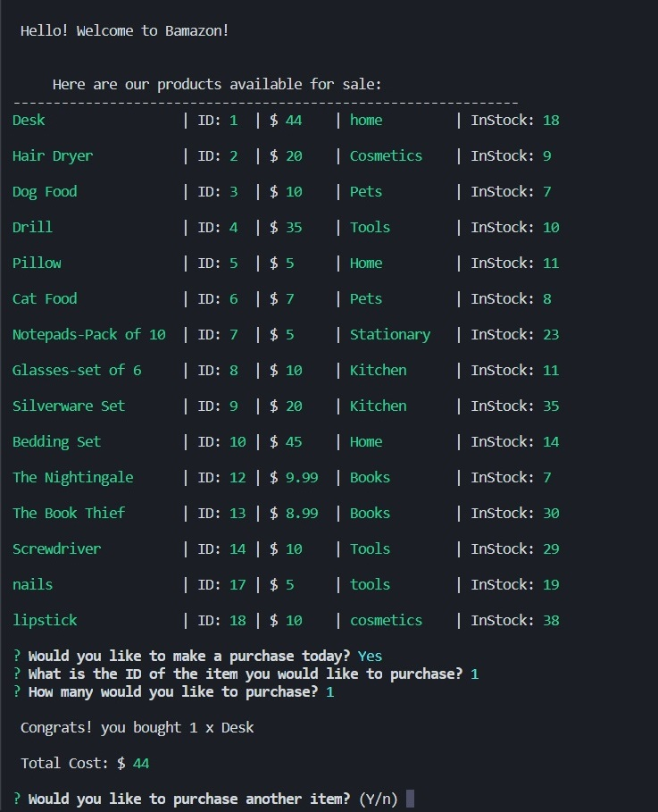
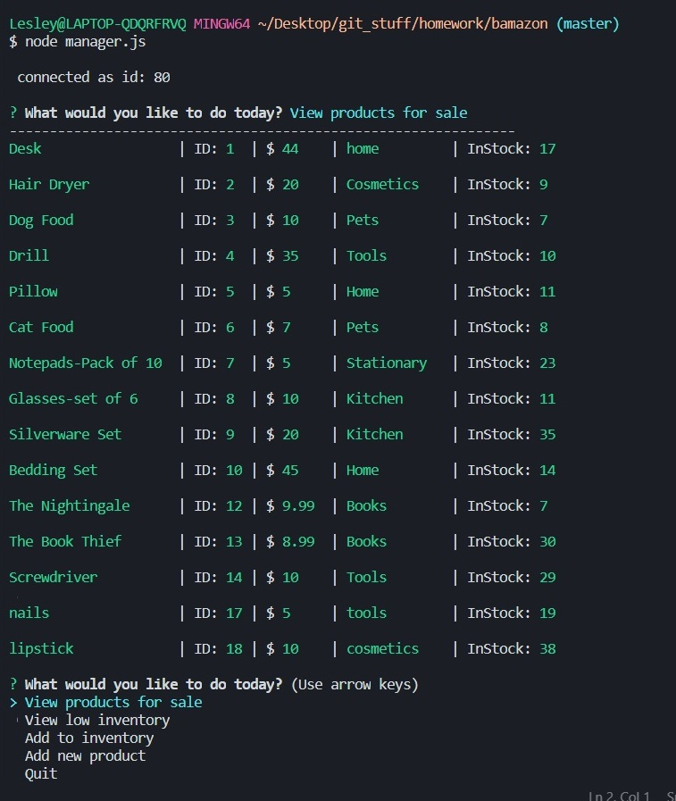
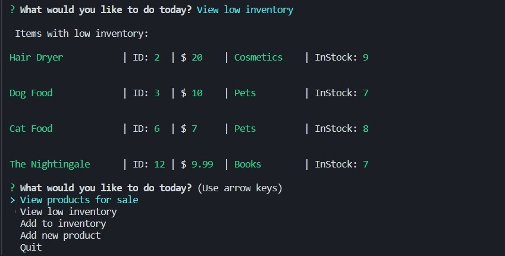
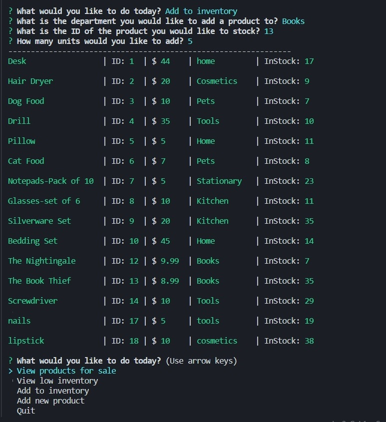
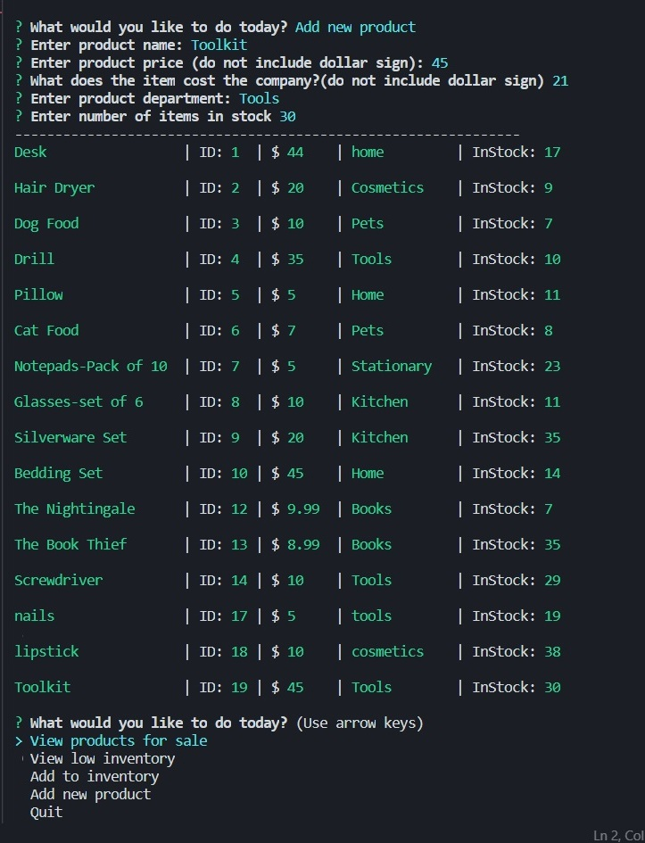
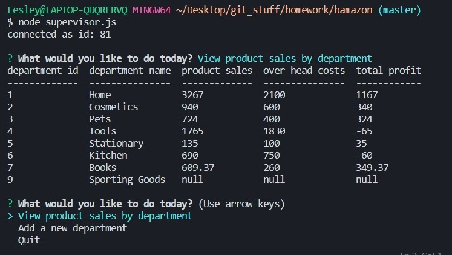
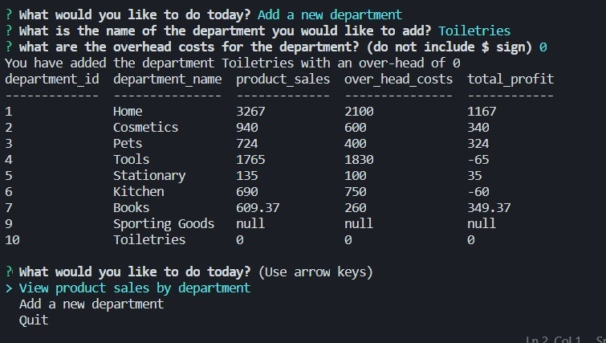

# Bamazon #

Hello! Welcome to the Bamazon Node App! 
This app has three sections, which allows the user to do different things!

# Customer Mode # 
 * View and buy products
 * Automatically updates stock quantities and product sales.
 

 # Manager Mode # 
 * View products
 * View items with low inventory
 * Add items to inventory, simultaneously updating overhead costs
 * Add products to a department, simultaneously updating overhead costs.
 
 
 
 
  
  
  

 # Supervisor Mode #
 * See overall product sales, overhead costs and profits
 * Add a department

  
This app will only run with the attached database, so to see screenshots please visit https://drive.google.com/open?id=1wEp_34UFon9vbWi7V9fbHS_xwi0ueQoJ
